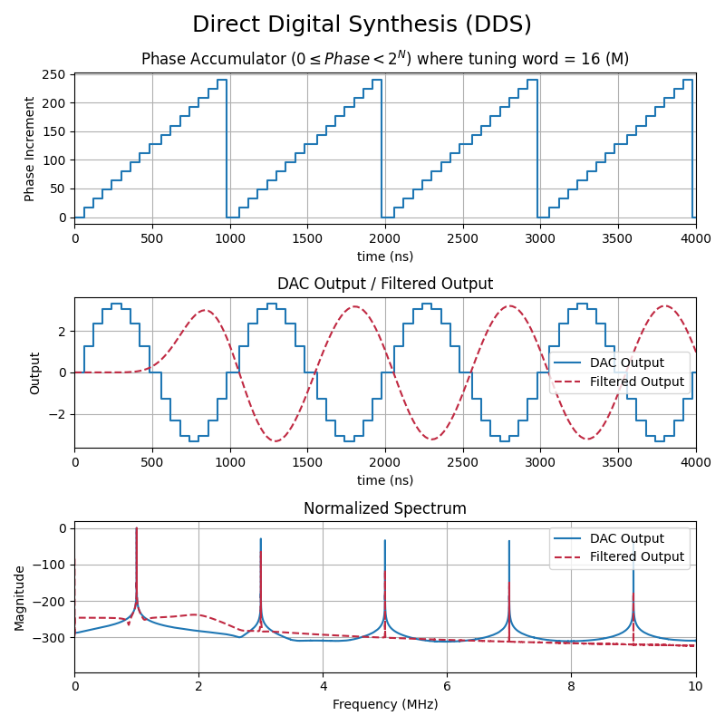

## Introduction

This repository demonstrates the operation of Direct Digital Synthesis (DDS) implemented within logic.

The three subplots shown below demonstrate each step of the DDS operation.
1. The phase accumulator increments the address by a step size M to adjust the output frequency. M=1 is the oscillation frequency of the DDS.
2. The corresponding DAC code is retrieved from waveform ROM using the phase address.
3. The DAC output is filtered and amplified by external circuitry.

## Theory of Operation

